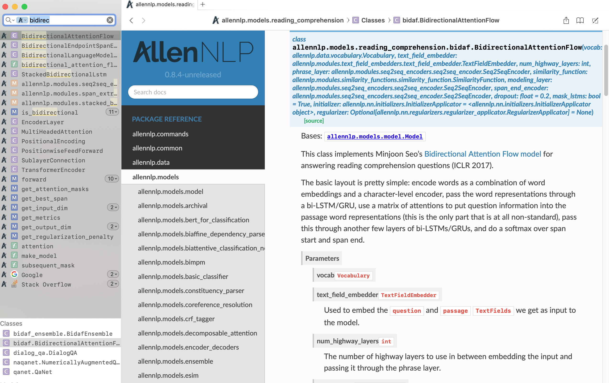

dash-docset-allennlp
====================



View [AllenNLP](https://allennlp.org/) docs in the [dash](https://kapeli.com/dash) offline docset browser.

To use, you can add this feed in Dash:
```
https://raw.githubusercontent.com/bckim92/dash-docset-allennlp/master/AllenNLP.xml
```
Or download the latest release [here](https://github.com/bckim92/dash-docset-allennlp/releases).

## Notes
- TODOs
  - Trim unnecessary fields
  - Automate docset generation process

## Steps to generate the docset

1. Build [AllenNLP](https://allennlp.org/) document with Sphinx
```
git clone git@github.com:allenai/allennlp.git
# Install dependencies, then
cd allennlp/doc
make html
```

2. Convert html document to docset
```
doc2dash ${allennlp_path}/doc/html -n AllenNLP -I index.html
```

3. Set additional configurations for docset
```
# Add icons
cp icon.png AllenNLP.docset/
cp icon@2x.png AllenNLP.docset/Contents/Resources/Documents/

# Set online redirection
vi AllenNLP.docset/Contents/Info.plist
# Add "<key>DashDocSetFallbackURL</key>" and "<string>https://allenai.github.io/allennlp-docs/</string>"
```

## References
- [dash-docset-tensorflow](https://github.com/ppwwyyxx/dash-docset-tensorflow)
